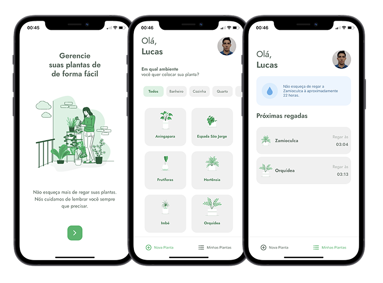

<h1>
  
</h1>

<p>An app developed for the user to be able to register plants and be reminded of when to water them.<br/>You can see the project layout <a href="https://www.figma.com/file/IhQRtrOZdu3TrvkPYREzOy/PlantManager/duplicate">here</a>. Developed during the <a href="http://www.rocketseat.com.br/">Rocketseat</a> NLW #5.</p>

## Screenshots 📷

<h1>
  
</h1>

## Technologies 👨‍💻

- [React Native](https://reactnative.dev/)
- [Typescript](https://www.typescriptlang.org/)
- [Expo](https://expo.io/)

## Install ⚙️

```bash
# Clone this repository
$ git clone git@github.com:lucalves/plant-manager.git

# Go into the repository
$ cd plant-manager

# Open the repository in the IDE (If you use VS Code)
$ code .

# Install dependencies with npm
$ npm install

# Start the application
$ expo start

# Start the fake api to simulate requests (replace <iphere> with your ip local address)
$ json-server ./src/services server.json --host <iphere> --port 3333 --delay 700

# Ready!
```

## License

MIT
